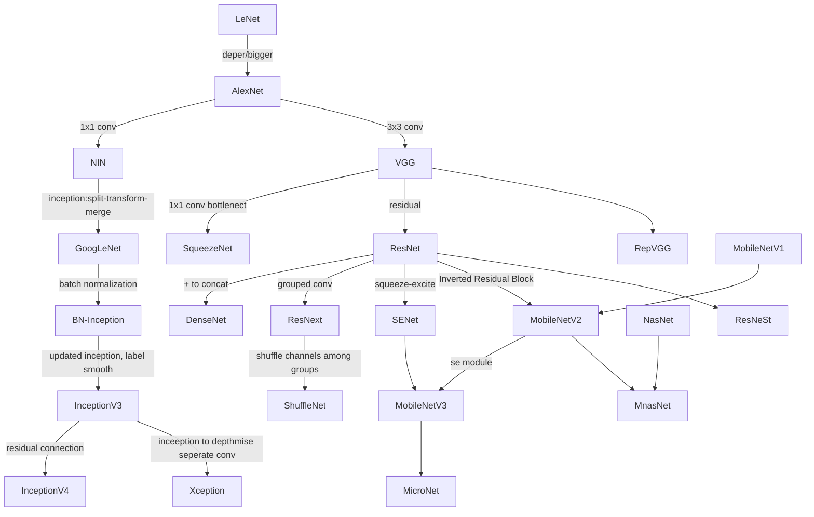

# 分类网络




# CIFAR10

| Model | Params | FLOPs | Acc(%) |epochs|
|:------:|:------:|:------:|:------:|:------:|
|VGG16|-|-|93.61|150|
|ResNet18| 11.18M | 37.12M | 87.95 |150|
|MobileNetv1| 3.22M | 11.80M | 87.98 |150|


```bash
python cifar_train.py --arch resnet --cfg resnet18_cifar --data_path F:\Datasets\CIFAR10 --job_dir ./resnet --lr 0.01 --lr_decay_step 50 100 --weight_decay 0.005 --num_epochs 150 --gpus 0
```